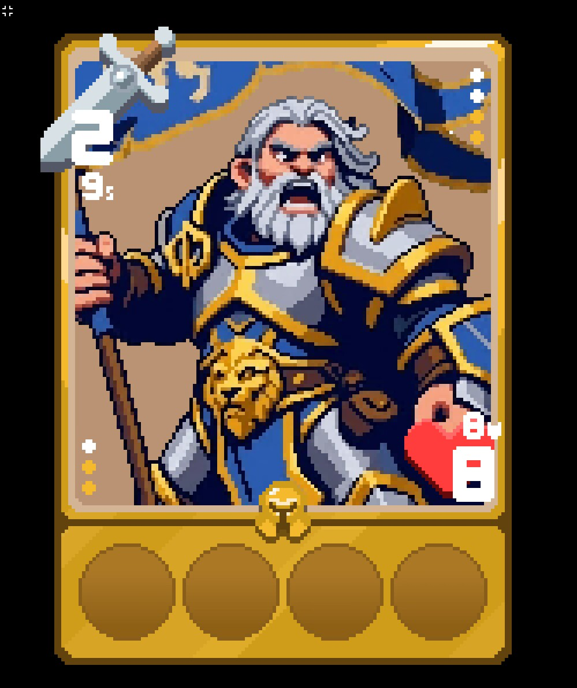
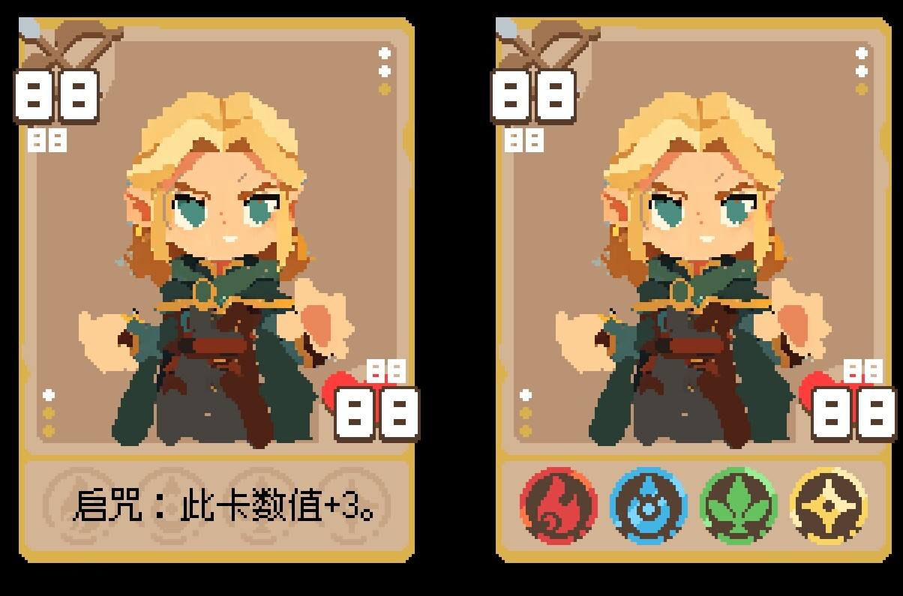
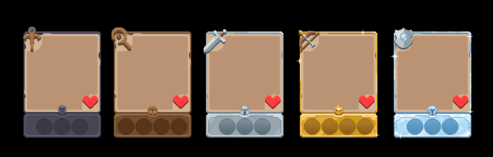
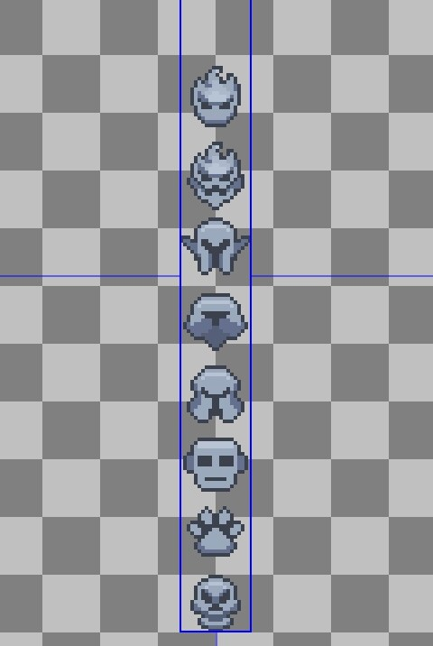
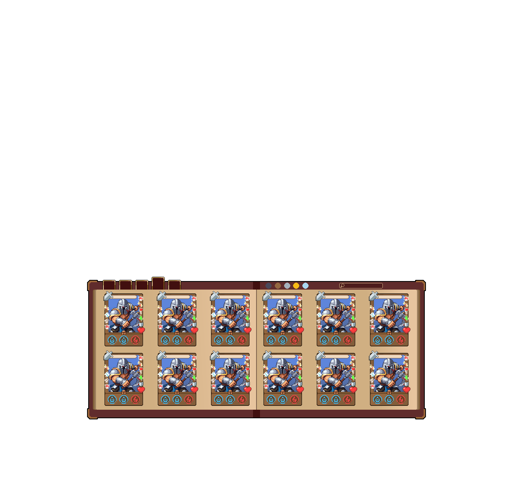
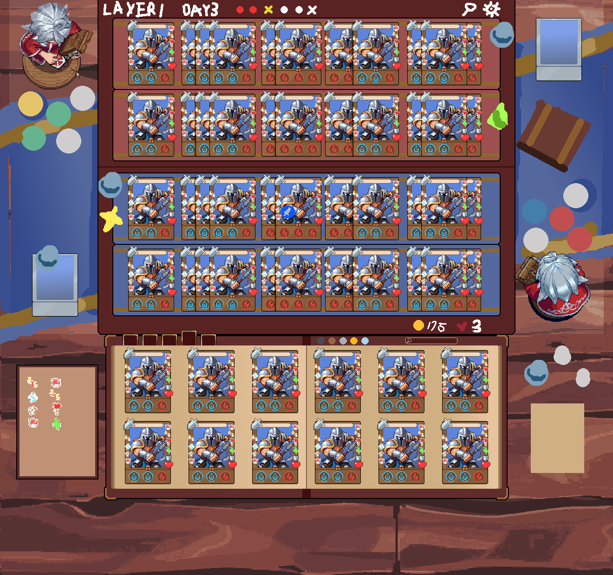
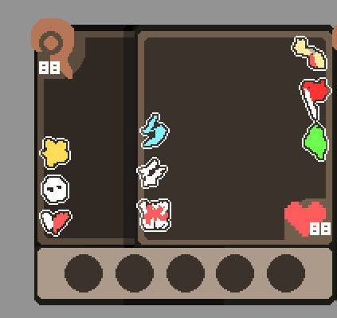
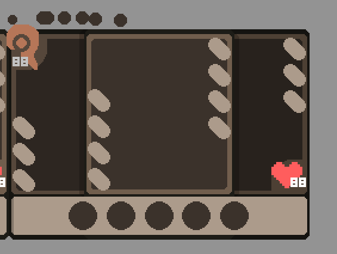
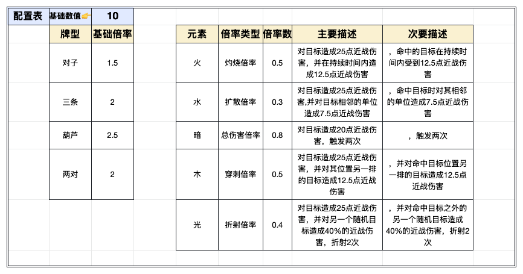

# Project Card Visual References

本文保存 Project Card 当前已确认的视觉参考图。图片来自前期 QQ 讨论记录，已复制到项目内的稳定路径，后续不再依赖 QQ 缓存目录。

## 图 1：随从卡完整卡面

用于说明：

- 卡面插画区域。
- 行动方式与数值位置。
- 生命值与护甲位置。
- 元素符文区域。
- 种族标识位置。
- 伤势与强化槽位的边缘分布方向。

## 图 2：卡牌效果与符文显示切换

用于说明：

- 鼠标悬停或右键切换后，卡牌下方区域可在效果文本与元素符文之间切换。
- 卡牌效果文本区域需要支持简短描述。
- 元素符文显示区域需要清晰展示多个符文。

## 图 3：行动方式图标

用于说明五种行动方式的图标表达：

| 行动方式 | 图标表达 |
| --- | --- |
| 近战 | 剑 |
| 远程 | 弓 |
| 法术 | 法杖 |
| 治疗 | 神杖 |
| 防御 | 盾牌 |

## 图 4：种族图标

用于说明种族标识的像素风图标方向。种族标识位于卡面与元素符文区域相交区域的中心。

后续补充的种族与稀有度色板保存在 `assets/races/race_rarity_sheet.png`，横向依次为稀有度 I、II、III、IV、V，纵向依次为人类、精灵、矮人、造物、元素、亡灵、魔族、野兽、植物。已按 6 倍整数缩放无损还原为透明原生像素图，并存放在 `assets/races/<race>/`。

各种族原生图标尺寸不同：人类 `11×11`、精灵 `13×12`、矮人 `13×12`、造物 `13×14`、元素 `11×14`、亡灵 `11×12`、魔族 `11×12`、野兽 `11×10`、植物 `9×9`。统一中心基准为裸卡局部像素坐标 `(49, 100)`：中心像素左右各有 49px，中心距离卡牌顶端 100px。布局时应以这个中心像素减去各自宽高的一半（整数像素取整）得到左上角，不能复用同一个左上角坐标。

Demo 测试卡已固定分配种族和 I～V 稀有度。`CardData.race_type` 决定种族图案，`CardData.rarity` 决定同一种族使用哪一列颜色；两者共同组成 `assets/races/<race>/race_<race>_<rarity>.png` 的资源路径。

24 张透明像素人物卡面保存在 `assets/card_art/`：保留原有 3 张，并加入“灰烬征册”的 21 张独立卡面。`CardData.art_texture` 保存卡面资源，每张 Demo 卡的名称与卡面路径均唯一。人物纹理以原生 1:1 像素居中显示，不再为了完整放入 `79×95px` 卡框内窗而进行非整数缩放；超出内窗的部分由 `ArtPanel` 裁切，使人物像素与 `99×136px` 卡牌框保持同一尺度。背景也限制在同一内窗，避免卡牌旋转时从外框透明边缘露出。

单张卡可通过 `CardData.art_offset` 调整取景，默认值为 `Vector2i(0, 0)`。正 X 将人物向右移动，负 X 向左移动；正 Y 将人物向下移动并露出更多头部，负 Y 向上移动并露出更多下半身。偏移必须使用整数，避免像素落在半像素坐标而变模糊。`ArtTexture` 放在普通 `ArtContent` 控件内，因为直接作为 `PanelContainer` 子节点时，Container 会覆盖手动设置的 `position`。

实时调整入口为 `scenes/tools/CardArtTuner.tscn`。运行 `Main.tscn` 后可点击底部“卡面调整器”进入，在 24 张测试卡之间切换，通过 X / Y 数值框或 1px 方向按钮实时调整人物取景，并可返回主界面。调整器适配完整 `1280×720` 虚拟画布，卡牌使用 4 倍整数像素预览。该 `@tool` 场景仍支持直接在 Godot 编辑器中实时显示：选中根节点后，也能在检查器选择 `Card Data` 并修改 `Preview Art Offset`。两种入口都使用 `CardData` 副本，只有点击“保存到卡牌资源”才会调用 `ResourceSaver.save()` 写入对应 `.tres`；也可重新载入资源值或把预览偏移归零。

4 倍预览会先用 `118×144` `SubViewport` 合成完整多层卡面，再由单一 Shader 统一执行鼠标跟随的 3D 透视和整卡扫光；左侧 10px 安全边按五种行动中最远伸到 `X=-9` 的治疗行动数字确定，同时容纳法术、治疗等不同尺寸图标和右侧生命槽，方向按钮绑定键盘方向键。参考效果来自 [Godot 4.5 卡牌 3D 与扫光示例代码](https://pastebin.com/2LvqYQRf) 和 [效果视频](https://www.bilibili.com/video/BV1f1xPztEpz/)。扫光不以法线贴图为前置条件；`CardData.art_normal_texture` 只保留为后续接入正式法线素材的可选增强入口，当前没有 Demo 卡绑定临时法线图。

项目使用固定 `1280×720` 虚拟画布，将卡牌、棋盘与 UI 合成为完整画面后统一缩放。默认以 `1920×1080` 固定窗口启动，也可切换 720p、2K 与自适应全屏：在 2K 显示器上使用 2 倍整数缩放，`99×136px` 卡牌最终显示为 `198×272px`；在 1080p 显示器上使用 1.5 倍缩放，以保持相同的 16:9 构图并铺满屏幕。运行时只读取仓库内的正式 1×素材，显示壳先以最近邻合成完整 1×画布，再一次性缩放到最终输出；代码不再维护独立分辨率素材切换。

阶段 6.5 的纵向世界内容为 `1280×1080`，这不是新的窗口分辨率。上视图取 `Y=0～720`，下视图取 `Y=360～1080`，所以屏幕始终是 `1280×720`，而中间 `Y=360～720` 的我方战场会同时出现在两种视图中。

## 图 9：阶段 6.5 收藏布局参考

此图只用于读取书本、顶部行动标签、搜索与 12 个卡位的坐标。页码改为显示在左右书页下角；卡牌仍由 `CardView` 实时绘制。

## 图 10：阶段 6.5 整体构图参考

此图只作为整体布局参考，不作为运行时背景。敌我人物必须同时存在：敌方人物固定正面；我方人物在敌我战场视图显示背面，在我方战场＋收藏视图显示正面。

运行时视觉资源按以下顺序分层，所有纹理均保持最近邻过滤：

| 层级 | 项目资源 | 用途 |
| --- | --- | --- |
| 1 | `assets/stage_6_5/wood_world.png` | 覆盖纵向世界的木桌背景 |
| 2 | `assets/stage_6_5/battlefield_background.png` | 战场整体背景板与侧边装饰 |
| 3 | `assets/stage_6_5/tablecloth_decor.png` | 背景板上的防滑装饰桌布 |
| 4 | `assets/stage_6_5/battlefield_wood_pad.png` | 桌布上的平整木板垫 |
| 5 | `assets/stage_6_5/battlefield_brocade.png` | 敌我四排战场锦缎 |
| 6 | `assets/stage_6_5/collection_book_cover.png` | 书皮、边框和书脊底座 |
| 7 | `assets/stage_6_5/collection_left_page_front.png`、`collection_right_page_front.png` | 普通收藏的独立左右书页正面 |
| 8 | `assets/stage_6_5/recent_cards_bookmark.png` | 切换最近使用卡牌的蓝色书签 |
| 9 | `assets/stage_6_5/recent_cards_left_page.png`、`recent_cards_right_page.png` | 最近使用模式的左右书页 |
| 10 | `assets/stage_6_5/collection_left_page_back.png`、`collection_right_page_back.png` | 两个翻页方向使用的纸张背面 |
| 11 | `assets/stage_6_5/character_front_back.png` | 敌方固定正面与我方切换正反面 |
| 12 | `assets/stage_6_5/collection_filter_icons.png` | 稀有度、元素与搜索框来源图集；各圆形筛选由独立 `TextureButton` 裁切显示并点击 |
| 13 | `assets/stage_6_5/card_type_tabs.png` | 随从、法术、装备、资源四个卡牌种类筛选书签 |

收藏册局部坐标中，书皮为 `872×359px`；普通收藏和最近使用的左右页均为 `413×309px`，位于 `(23,25)` 与 `(436,25)`。蓝色书签相对书本位于 `(-35,82)`；行动方式书签组位于 `(42,0)`，卡牌种类书签组位于 `(266,0)`。活动页作为一张完整节点，以书脊侧为转轴分两段横向压缩和展开；覆盖层另外保存旧固定页与目标固定页，活动页中点切换到目标侧页面，并由 Godot 动态绘制书脊投影和自由侧页边。物理页码是各页面快照的子节点，复用卡牌基础数值字体并随对应纸页运动。该结构只根据物理页码计算，可复用于最多 100 个物理页。

主界面已针对 720p 虚拟画布重新压缩边距和垂直空间：卡牌详情预览由 3 倍改为 2 倍，收藏静止显示恢复为原生 1 倍，并保留悬停与拖动的安全边。战场行运行时宽度固定为 `832px`，其中满排内容固定为 `801px`，左右各留 `15.5px`，七张卡占外框宽度约 `96.3%`。在默认 2K 的 2 倍缩放下，半像素边距会映射为整数 `31px`，不会破坏 2K 的完美像素显示。

当前统一卡面背景保存为 `assets/card_backgrounds/card_background_placeholder.png`，源素材尺寸为 `97×102px`，显示时完整缩放到卡框内部 `79×95px` 窗口。显示顺序为卡面背景、透明人物、稀有度卡牌框，后续仍可通过 `CardData.background_texture` 为单张卡替换专属背景。

I～V 五种稀有度卡牌框保存在 `assets/card_frames/`，每张均为原生 `99×136px`。卡牌框的插画窗口和外部圆角已经透明；`CardView` 根据 `CardData.rarity` 选择对应框，并将框叠在卡面背景与人物之上、数值和种族图标之下。

卡牌名框保存在 `assets/card_ui/card_name_frame.png`，使用最终的原生 `83×11px` 素材；在裸卡局部坐标 `(0,4)` 显示，即紧贴卡牌左边并距离顶端 4px。它位于稀有度卡牌框之上、名称文字和行动图标之下。

卡牌名字使用名字框内 `(21,4,61,10)` 的安全文字区域：左侧避开行动图标，右侧保留 2px 边距，垂直居中并裁切越界内容。基础字号为 `7px`，当名称宽度超过安全区域时会逐级缩小到最低 `5px`；当前最长的五字测试名“影弦游击手”可完整落入名字框。文字暂时使用 Godot 的中文回退字体和深棕色，待美术提供可商用中文像素字体后只需替换字体资源，不需要再次调整框内布局。

## 图 5：元素符文图标

用于说明五种元素符文的图标方向：

五种元素符文均使用原生 `23×23px` 透明 PNG，与卡牌底部的 `23×23px` 圆形空腔一比一显示，不进行缩放。原始横向图从左到右依次为暗、火、水、光、木，相邻图标间隔 `7px`。

参与当前牌型的可见符文改用 `assets/runes/rune_active_flow_sheet.png` 中的 14 帧流光版本；未参与牌型的战场符文、被遮挡符文与收藏符文继续使用新版静态 PNG。流光精灵表同样按暗、火、水、光、木排列，并保持每枚原生 `23×23px`。全部战场流光读取同一个 2.0 秒全局时间轴；新上场或新加入牌型的槽位先显示静态图，到下一轮流光起点时再与其他卡牌同时播放。

真实牌型不叠加呼吸灯或其他光晕，只保留同步流光。`ACTIVE_RUNE_CYCLE_SECONDS` 控制 14 帧流光的完整循环时长，`ACTIVE_RUNE_START_PHASE_SECONDS = 1.4` 固定此前人工确认的首次起播画面。真实全局时钟在第一张拥有牌型的卡成功进入战场时才启动，预览不会提前启动；当战场不再包含任何参与牌型流光的符文时计时器重置，即使仍留有混乱等无流光符文的卡牌，下一张特效卡也会建立全新计时器。切换显示属性不会改变牌型数据或流光加入轮次。

牌型预览不再显示常亮光晕、渐显、渐隐或残影。玩家视角中的实体卡一视同仁：场上原有目标卡与手中拖拽卡都使用假设牌型的参与槽位和流光时间轴，并保持 `1.0` 的完整颜色；只有新增的结果虚影卡使用 `PREVIEW_ACTIVE_RUNE_ALPHA` 降低流光透明度。取消、切换或确认放置时直接按新结果刷新流光，不保存或迁移额外的光晕状态。

| 元素 | 方向 |
| --- | --- |
| 火 | 红色火焰 |
| 水 | 蓝色水滴 |
| 木 | 绿色叶片 |
| 光 | 黄色星芒 |
| 暗 | 紫色月牙 |

## 图 6：两张卡牌堆叠示例

用于说明：

- 两张卡牌堆叠后形成小队。
- 被遮挡区域不再生效。
- 未被遮挡的元素符文按从左到右形成牌型。
- 每张卡都保持完整 `99×136px` 形态，并以水平错位形成实际堆叠表现。
- 各卡的元素符文区与效果区继续属于各自卡牌，不再整合成统一面板。

## 图 7：三张卡牌堆叠示例

用于说明：

- 三张卡牌堆叠后的最大复杂度。
- 可见元素符文和遮挡关系。
- 多卡堆叠时整体占位、吸附和表现格式。

## 图 8：牌型与元素效果配置表

用于说明：

- 基础数值暂定为 10。
- 牌型倍率目前包含对子、三条、葫芦、两对。
- 元素倍率目前包含火、水、暗、木、光。
- 顺子和同花的倍率及效果仍待补充。

## 文件清单

| 文件 | 内容 |
| --- | --- |
| `docs/images/card-minion-full.png` | 随从卡完整卡面 |
| `docs/images/card-effect-toggle.png` | 卡牌效果与符文显示切换 |
| `docs/images/action-icons.png` | 行动方式图标 |
| `docs/images/race-icons.png` | 种族图标 |
| `docs/images/rune-icons.png` | 元素符文图标 |
| `docs/images/card-stack-2.png` | 两张卡牌堆叠示例 |
| `docs/images/card-stack-3.png` | 三张卡牌堆叠示例 |
| `docs/images/combo-config-table.png` | 牌型与元素效果配置表 |
